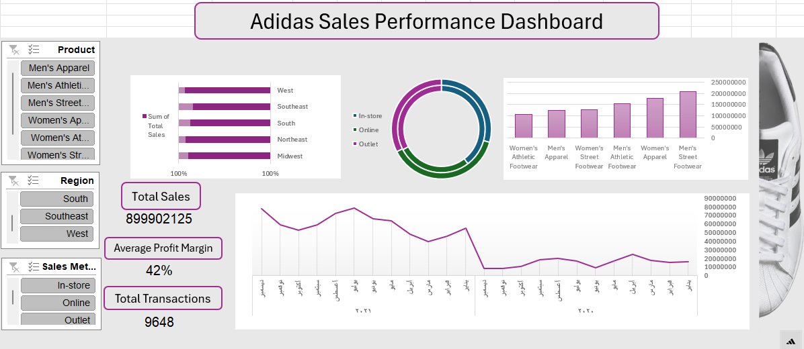

📊 Adidas Sales Analysis – Excel

📌 Overview

A practical assignment completed as part of an Excel course. 
The dataset was provided by the instructor, and the assignment focused on creating a Sales Dashboard and summarizing the data.

 Dashboard Questions ❓

The dashboard was designed to answer:

- What is the best-selling product during the selected period?
- Which region achieved the highest total sales?
- Which sales method performed the best?
- Is there a noticeable change in sales across months?
 
 Project Contents 📂

 📊 Adidas Data - Dataset provided by the instructor 
 🔄 Pivot Tables - Used to summarize the data 
 📈 Dashboard - Final dashboard created for the assignment 
 
🛠️ Tools Used
- Microsoft Excel
- Pivot Tables
- Excel Charts
- Basic Data Analysis

